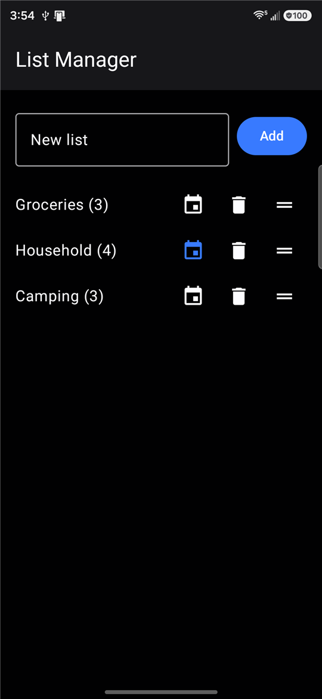
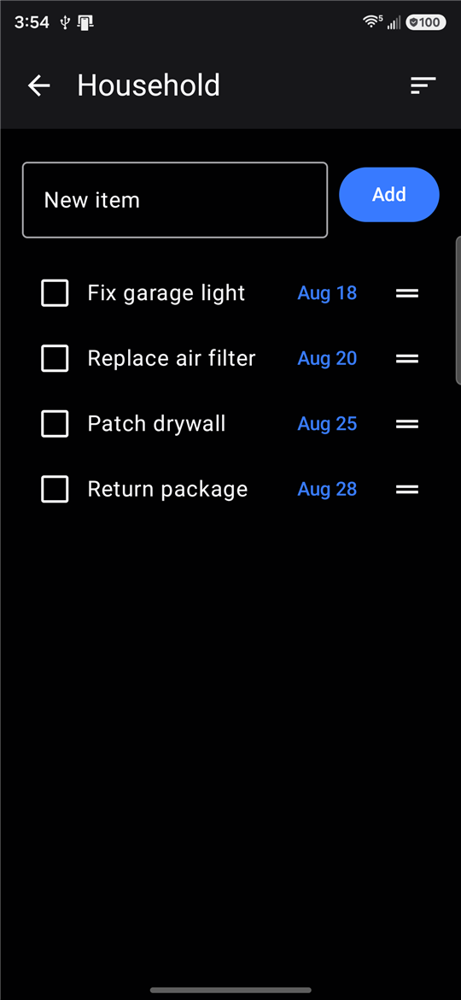
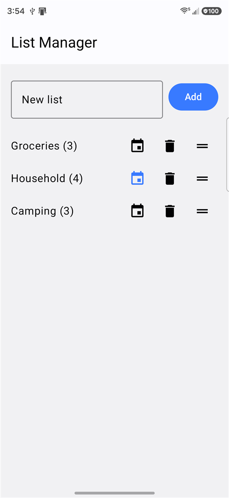
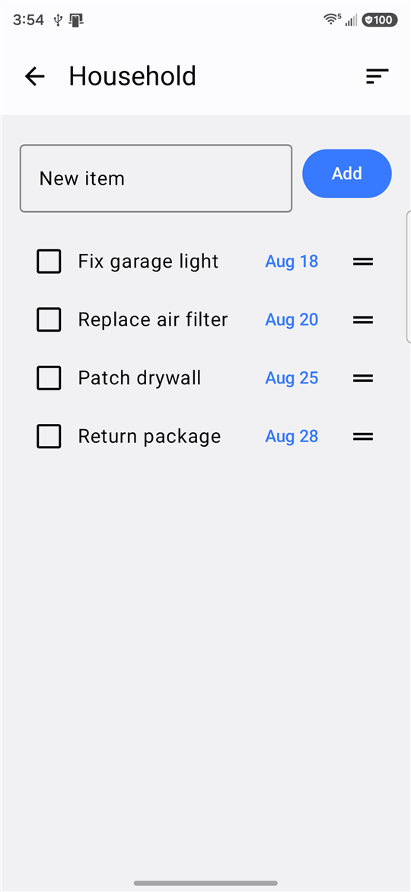

# List Manager

[](https://github.com/dnoeltx/ChecklistV1/actions/workflows/ci.yml)

A multi-list checklist app for Android — create separate lists (e.g. "Groceries", "Household"), add items, check them off, set optional due dates, and reorder everything with drag-and-drop. Data persists locally on the device.

Built as a hands-on project for learning modern Android development with AI-assisted coding.

Signed release builds are published automatically on the [Releases page](https://github.com/dnoeltx/ChecklistV1/releases).

## Screenshots

| Lists | Items | Lists (light) | Items (light) |
|:--:|:--:|:--:|:--:|
|  |  |  |  |

The app follows the system light/dark setting — the same screens are shown in both above.

## Features

- Create and delete multiple named lists
- Add items to a list; checking an item off hides it from view
- Each list shows a live count of remaining (unchecked) items
- Drag-and-drop reordering of both lists and items within a list
- Optional **due dates**, enabled per list — items get today's date by default, editable with a date picker, and a one-tap action reorders the list by date
- Local persistence via Room/SQLite — data survives app restarts *and* schema upgrades
- Custom adaptive app icon
- Follows the system's light/dark theme automatically

## Tech stack

- **Kotlin**
- **Jetpack Compose** + **Material 3** for the UI
- **Room** for local persistence, with **KSP** generating its code at compile time
- [**Reorderable**](https://github.com/Calvin-LL/Reorderable) for drag-and-drop list reordering
- Architecture: Composable screens observe a `Flow` exposed by a `ViewModel`, which reads and writes through a Room DAO. The DAOs are passed in via the constructor, so tests can substitute in-memory fakes.

## Data model

Two Room entities:

- `TodoList` — id, name, position, dueDatesEnabled
- `ChecklistItem` — id, listId (foreign key → `TodoList.id`, `ON DELETE CASCADE`), text, isChecked, position, dueDate

Deleting a list automatically deletes its items.

Due dates are stored as ISO-8601 text (`"2026-08-18"`) rather than epoch milliseconds: a due date is a day rather than an instant, so this sorts correctly in plain SQL and avoids timezone drift.

The schema is versioned and exported to [`app/schemas`](app/schemas), and changes ship with a real migration — upgrading the app preserves existing data.

## Testing

```
./gradlew testDebugUnitTest
```

Three layers, all running on the JVM with no device required:

- **ViewModel tests** against hand-written in-memory fake DAOs — fast feedback on logic
- **DAO tests** against real SQLite via Robolectric — these execute the actual generated SQL, so a wrong `ORDER BY` or a broken `GROUP BY` fails here rather than on a phone
- **Migration tests** using `MigrationTestHelper`, which builds a database from the committed v3 schema, migrates it, and validates the result against v4

## CI/CD

- **CI** ([`ci.yml`](.github/workflows/ci.yml)) compiles and runs the test suite on every pull request
- **CD** ([`release.yml`](.github/workflows/release.yml)) triggers on a `vX.Y.Z` tag: it derives the version from the tag, builds a release APK signed with a key held in GitHub Secrets, verifies the signature with `apksigner`, and publishes the APK to a GitHub Release
- Dependencies and GitHub Actions are kept current by Dependabot

## Requirements

- Android Studio
- `minSdk` 24, `targetSdk`/`compileSdk` 37

## Building & running

Open the project in Android Studio and run it, or from the command line:

```
./gradlew installDebug
```
